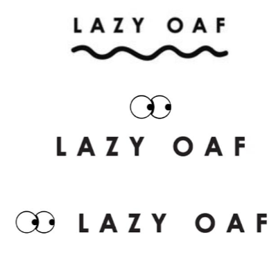

**When it comes to logos, Lazy Oaf created theirs very precisely. While there are multiple iterations of the logo (see pictures below), they all carry the same intended message- as well as mostly being accompanied by their signature eyes. In stark contrast to the nature of their products, the logo contains no colour and is very uniform and clear. The most the logo strays from its uniformity is when it is presented in circular form, making it seem a little softer than when simply lined.**

This clarity and uniformity is chosen specifically to contrast with the products so as not to take away from them and emphasise their individuality and use of bright colours in said products. Where Lazy Oaf are a very laid back brand, they make it extremely clear in their brand book that the logo must always be black and white- easy to read and clearly stands out among their colourful designs. Of course the colour of and around text is a very big contender in regard to how it is interpreted by whomever is reading it but I shall touch on that in a later post, for now I will focus on font and typeface.

The primary font used for the Lazy Oaf logo has been identified online (thank god for reddit) as Futura. This font is sans serif and therefore has a more modern and legible appearance with this clarity being very much aided by the fact that the text is in all capitals and bold- this also gives it more impact. A key factor in the use of sans serif fonts is the fact that they are considered more modern and clear because they were only first seen in the early 20th century. Due to their relatively late development they have come to be associated with a much less pretentious atmosphere; something that certainly reflects the core values of the Lazy Oaf brand- such as striving to maintain a “more personal” relationship with their consumer.

This very clean and geometric font is sometimes softened with the use of a wiggly underline when at the top of the product browsing pages. While this adds some clashing softness to the text, the name retains its strong modern and independent identity.