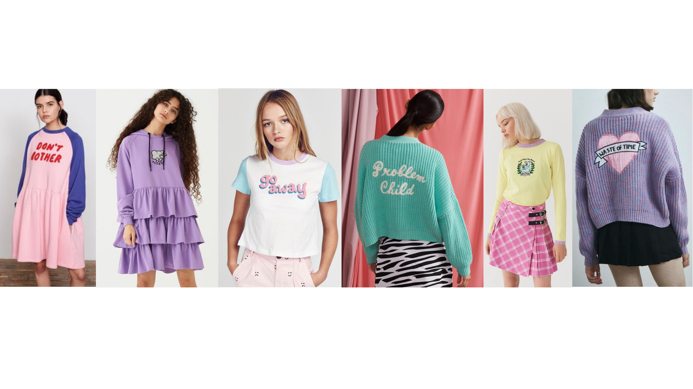

**Colour is everything when it comes to Lazy Oaf’s branding. Without this part of its identity, the tone of the brand could never be what it is intended.**

**The first notable colour choice is that of the logo being a simple, constant black and white- whereas Lazy Oaf products are often colourful and bold. This contrast is very much intentional, Lazy Oaf release various collections that fit various aesthetics therefore it would be near impossible to create a logo that encompasses an overall aesthetic of the brand. So logically, they did the exact opposite and created a bold, clear, black and white logo.**

**Although at first black and white seem very one-dimensional in terms of the tone they set, they actually speak volumes- especially when used to highlight a product. The plain black and white of the logo creates a sense of balance and completion; almost a calm to contrast the chaos of the many patterns and bright colours of Lazy Oaf products.**

**This is a conscious decision so as not to draw attention away from the products. Another use of colour worth noting is the simple white background of the website on which all of the text is presented- this creates an open atmosphere of creativity, once again reflecting the core values of the brand.**

**The colour of Lazy Oaf products and the slogans on many of them is approached very differently to that of the logo. They tend to use bright or pastel colours and almost childlike themes but often with “depressing” or explicit slogans such as “Fuck What You Heard” which is one of the many designs pictured below. Full of oxymorons and wonderfully unique.**

**Lazy Oaf have truly used cutesy, childlike clothing with explicit slogans on them to create a brand identity like no other. And I, for one, bloody love it.**