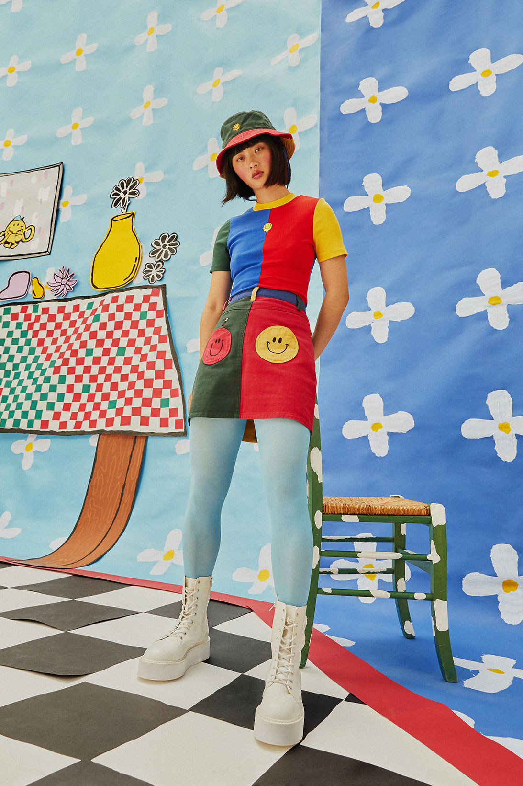
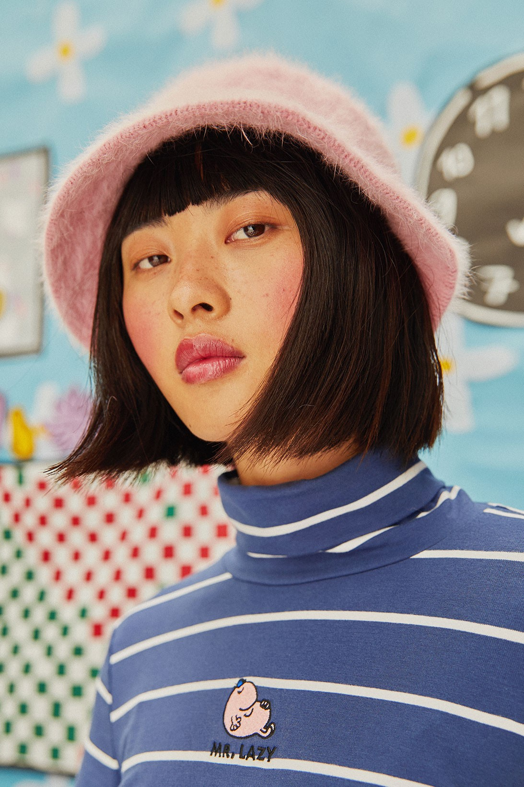
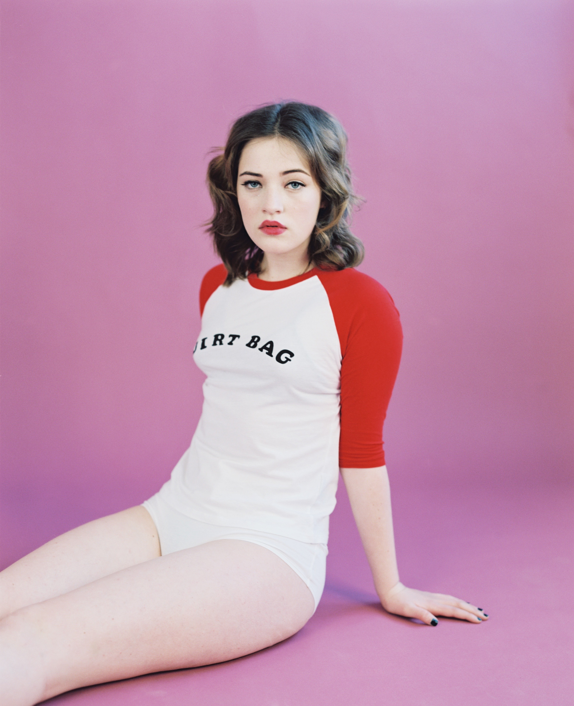

A key part of the Lazy Oaf brand is the role of nostalgia in the choice of collection themes. The founder of the company, Gemma Shiel, grew up in the 90s and this is where a lot of their nostalgia trips draw from. This nostalgia that is very present in their products and takes strong form in the typography of the Lazy Oaf designs.

Lazy Oaf have taken part in many collaborations with nostalgia-fueled branding such as the Flintstones, Mr Men, Looney Tunes, Casper, Hello Kitty and Garfield. These brands all have trademark fonts that inspire nostalgia in 80s, 90s and 00s kids which hits a broad spectrum of ages.

The use of colour-blocking in their Mr Men collaboration is reminiscent of the 80s fad which bled into 90s fashion and their use of primary colours (red, yellow and blue) denotes a sense of simplicity that is often associated with childhood. This collaboration is very nostalgic as the Mr Men books by Roger Hargreaves were a part of many british childhoods since the first one was published in 1971. The majority of this collection features graphic designs and embroidery of various Mr Men on the products. The most notable text in this collection is the repeated use of “Mr Lazy”- the clear double meaning here is the connection between the actual Mr Men character, Mr Lazy, and the name of the brand being Lazy Oaf. This text is simplistic and doesn’t draw attention from the designs as it is relatively small and simple black, sans-serif font. It takes up very little space and is positioned central yet over the upper chest and therefore is not the centre of attention when looking at the product. In this particular collection the text is not the main focus; instead it is the images of the various characters.

The nostalgia trips are not just limited to their 90s media themed collaboration collections, Lazy Oaf also have collections solely by them which radiate 90s nostalgia- such as their Rebel Girl collection from 2016. In true 90s grunge style this collection featured babydoll dresses, baseball tees and denim dungarees. A good example of the use of typography to add to the sense of nostalgia is their “dirt bag” baseball tee.

The font of the text on the shirt is a bold, slab-serif typeface and it’s varying stress (thickness) in the letters gives it a more hand-written and youthful feel. This enforces the bold and distinctive tone that Lazy Oaf instil in their products. That is my hot take/analysis on Lazy Oaf, nostalgia and its links to typography.