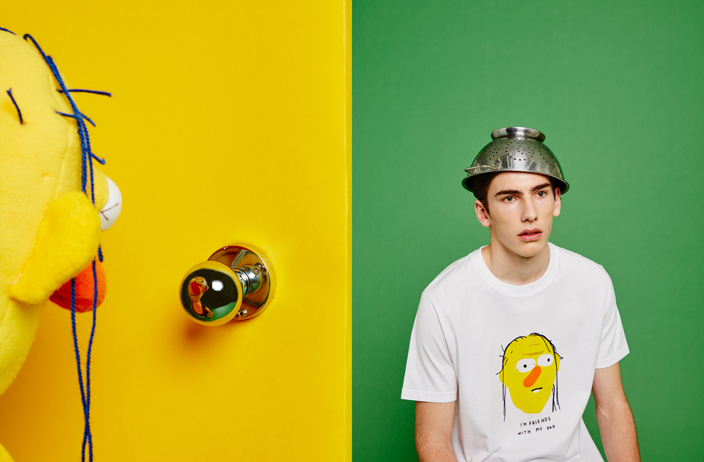
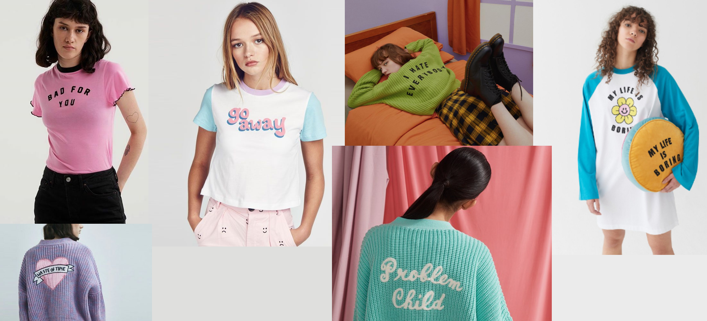

Many of Lazy Oaf’s products cater very well to alternative aesthetics, especially kinderwhore, pastel goth and nu goth. Kinderwhore and grunge aesthetics were very popular in the 90s (circling back to the nostalgia aspect of the brand) and have undergone a recent resurgence, as well as goth/punk fashion and their subcultures. 

Kinderwhore was made popular by 90s female grunge bands. The main purpose is that it looks feminine and sometimes childlike but with a punky attitude and a risqué twist. This style is commonly attributed to Courtney Love of Hole and is heavy in irony. Pastel goth incorporates the basic elements of dark goth style with pastel colours, it is generally grunge and involves occult themed clothing. Much like kinderwhore clothing it combines two juxtaposing ideas- creepy and cute. Nu Goth is a modern take on goth subculture that is heavily rooted and influenced by traditional gothic music, aesthetic and philosophy. For this reason occult clothing, symbology and sacred geometry is a vast part of the Nu Goth aesthetic and fashion.

Lazy Oaf’s key slogan is “keep it weird” which already shows they aim to cater to a niche market of people with alternative styles- this is certainly reflected in their designs. 

In terms of fitting into a specific aesthetic, Lazy Oaf designs are very flexible, they boast their attribute of not really fitting into any one particular scene.

Once again, their collections reflect their aim to appeal to a more alternative customer. For example, the aforementioned Rebel Girl collection (which is very reminiscent of 90s grunge) and their collaboration with creepy comedy YouTube series “Don’t Hug Me I’m Scared”.

Not only do some of their special collections appeal to these styles, but their designs do too. This is mostly through the juxtaposing aspects of font, colour and content.

Almost all of the time the clothing designs that feature slogans stick to the tone of cutesy colours/silhouettes but explicit and somewhat depressing slogans. It is this irony and juxtaposition that appeal to the kinderwhore, pastel goth and nu goth aesthetics. Although sometimes their slogan clothing is simply grunge in its tone, for example the “I hate everybody” knitted cardigan- which is pictured below.

Use of bright, pastel colours but script fonts, such as the one used on their “problem child” cardigan and “go away” t-shirt (pictured above),  to juxtapose. More specifically, they use formal script typefaces which are reminiscent of calligraphy and have an elegant feel about them. Not only do script fonts have a sense of elegance, they also often have connotations of creativity and childishness. When paired with the words “problem child” and “go away” they are undoubtedly kinderwhore in essence.