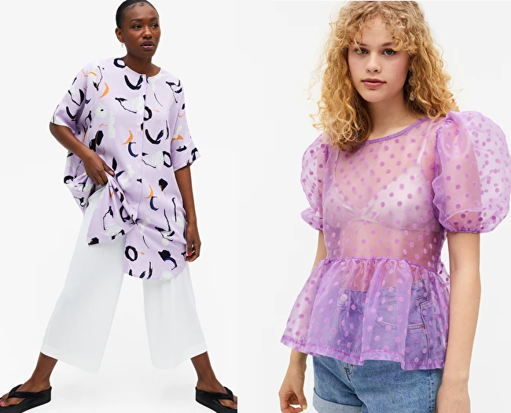
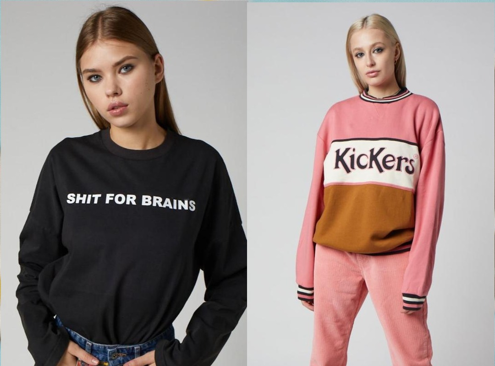
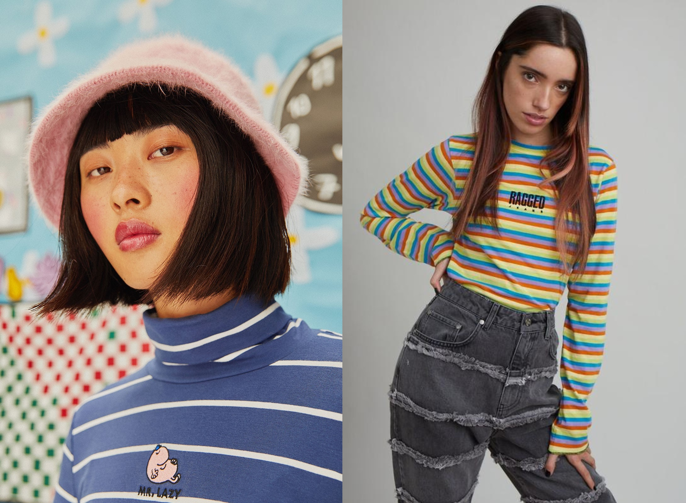
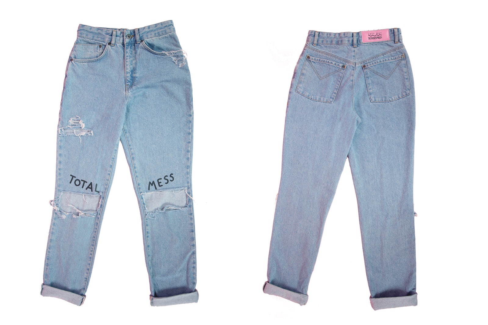

Lazy Oaf share some of their design characteristics with their competitors. Lazy Oaf’s main competitors are: Urban Outfitters, The Ragged Priest, UNIF, Monki, Motel Rocks and Illustrated People. Lazy Oaf identify themselves and their products as carefree and humorous as well as weird, fashion-forward, colourful, inclusive and fun. They share these key features with several of their main competitors. The alternative and quirky tone of Lazy Oaf is often shown in their different and lighthearted graphics.

One of LO’s competitors, Monki, are commonly known for their fun, colourful and daring designs which is very similar to Lazy Oaf. Their website boasts a lot of colourful and flamboyant clothing such as those pictured below.

Another of Lazy Oaf’s main competitors is The Ragged Priest who, similar to Lazy Oaf, use slogans and often bright colours in their designs. Not only this but their slogans also tend to be explicit/edgy, for example their “shit for brains” tshirt which is pictured below.

Another similarity between Lazy Oaf and The Ragged Priest is the text placement on their clothing- particularly tops. Both brands tend to place their text on tops at the top centre- over the upper chest. This placement ensures that the text doesn’t overpower the garment itself and achieves a more understated feel.

Although they are competitors, Lazy Oaf did collaborate with The Ragged priest in 2015 on a denim collection that combined their uses of edgy slogans and script fonts with a handwritten feel.

For example this pair of jeans that featured in their collaboration collection feature the words “total mess” on the knees which is the epitome of their shared style. This collection also had a 90s feel which fed into the nostalgia aspect of Lazy Oaf’s branding.