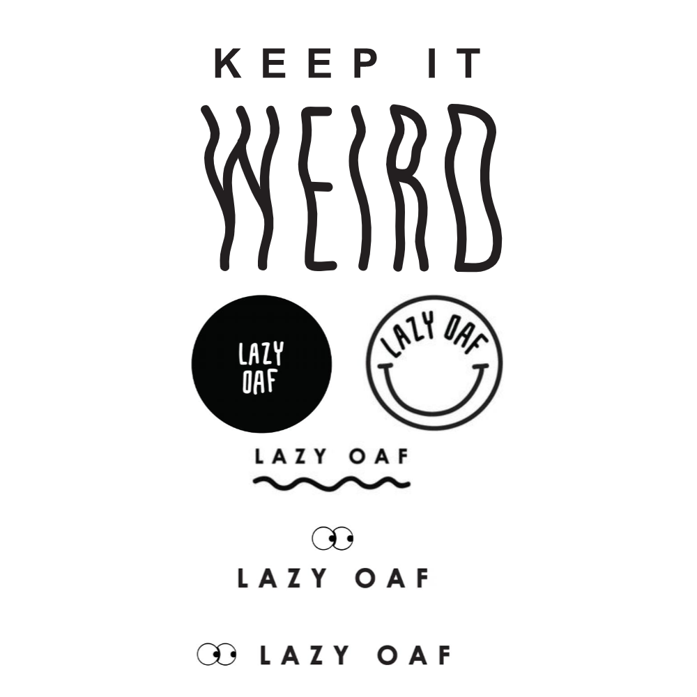
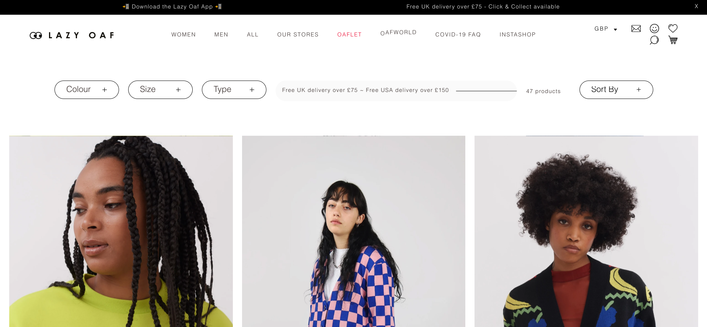
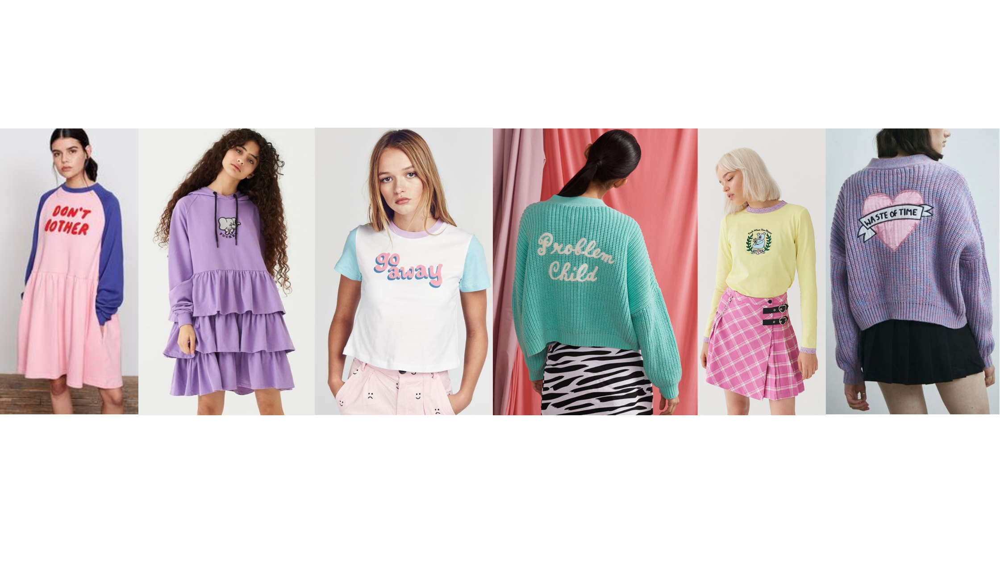

When it comes to Lazy Oaf’s use of fonts there are 3 notable aspects to it: the use of fonts in their logos and slogan, the font they use on their website and the fonts they use on their products. These three aspects can contradict each other greatly but the way that they interact is very intentionally calculated by the brand and serves the purpose of balancing the aesthetics of the website.

Lazy Oaf use more than one font for their logos and slogan, they have a few different logos that they use and the one key slogan of “keep it weird”.

Their logo fonts are special and unique which places an emphasis on individuality- something that is consistent across the entire brand’s image. The fonts in the bottom three logos are sans-serif and mono-spaced and therefore very clear and legible. Whereas the font used in the circular logos is also sans-serif but has a more hand-written look and therefore is slightly more playful- especially with its placement in circles which connotes completion and harmony. When it comes to their slogan- “keep it weird”, they use the same font as the bottom three logos for the words “keep it” but a different original font for the word “weird” to set it apart and enforce its meaning.

All of Lazy Oaf’s logos are in black and white and they always present the name of their brand horizontally and in full, this is for clarity and uniformity in contrast to (and in order to not take away from) the colourful and busy nature of their product designs. 

In terms of their website, Lazy Oaf uses black Arial font on a white background, mostly in size 9 so as not to overstate it and draw attention away from any words on the garments. Arial is a sans-serif typeface and therefore connotes a break-away from tradition and has implications of progress and informality. The use of Arial makes the text look clear and aesthetically pleasing and once again this provides clarity and uniformity amongst the colourful chaos of their products. 

The website never features busy backgrounds so that the text is perfectly legible, clear and uniform. This implies their commitment to quality and differs greatly from the fonts used in their product designs. It is now that we come to the notable subject of the font vs the words. The oxymoronic relationship between these two aspects of Lazy Oaf’s products is a key feature of the brand.

When it comes to clothing designs, Lazy Oaf tends to use script fonts. More specifically, they use formal script typefaces which are reminiscent of calligraphy and have an elegant feel about them. These script fonts have a sense of elegance and implications of creativity and childishness. When used with slogans such as “problem child” and “go away” they present a very oxymoronic aesthetic.

Almost all of the time the clothing designs that feature slogans stick to the tone of cutesy colours/silhouettes but explicit and somewhat depressing slogans. This ironic juxtaposition shows the brand’s carefree and humorous tone and somewhat implies imperfection. Self described as weird, fashion-forward, colourful, inclusive and fun- Lazy Oaf certainly portray this through their use of different typography in different contexts.